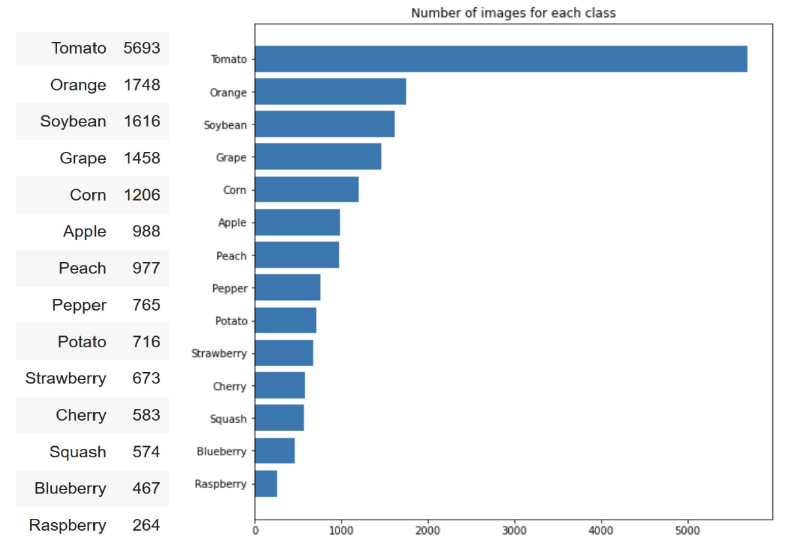

# Leaf Image Classification 
Goal: Build the model to predict 15 leaf classes with a state-of-the-art model and architecture.

## Dataset structure
The provided dataset for this project contains 17728 images already divided into sub-folders, based on their class. There are 14 different classes available.
 
From this dataset representation, we can see that each class does not close to a uniform distribution number, we can say that we have an imbalanced dataset. So we need to deal with this problem.

## Imbalanced dataset

In order to learn our model we should handle imbalanced data. We tried to implement two different approaches to manage the imbalanced class-repartition for our training data. We have tried two scenarios, balanced class weight then combined with data augmentation, and balanced data for each class. We also use Precision-Recall Curve (PRC) metrics to monitor our learning process. Precision-Recall curves summarize the trade-off between the true positive rate and the positive predictive value for a predictive model using different probability thresholds.

We have chosen PRC metrics for monitoring the learning process because we should take into account the imbalanced data train. The Accuracy metrics will lead us to misleading results. We will mostly always have high accuracy because the accuracy formula is the ratio of the total number of correct predictions over the total number of predictions. The fact that the Tomato class has a high number of training images. It influences accuracy results in a nondesirable way because the Tomato class can be considered as the dominant class and species with fewer class instances are minority classes. With Accuracy, there is no distinction between the numbers of correctly classified images of different classes. Therefore we should use another metric that can handle an imbalanced dataset. We combined the Precision and Recall metrics that are more promising to inspect the training process. We used PRC metrics to compare precision and recall combination results in each epoch. 

2.1 Balanced class weight and Data Augmentation
About balanced class weight, in the model fit we are using class_weights parameters to have balanced weight based on the number of each class. So for this case, the Tomato class will have the lowest weight, and the Raspberry class will have the highest weight. 

With regard to Data augmentation, we have implemented data augmentation to manage imbalanced data. By implementing rotation, height shift, weight shift, zoom, flip and we realized that fill mode nearest got better result than reflect. So we are combining  balanced class weight and data augmentation. 

2.1 Balanced data for each class
In this scenario we try to generate data manually for each class by using Data Image Generator and save generated data with the original data, then we will get a balanced training dataset for each class. Here is the Google Drive link to download the augmented dataset (https://drive.google.com/file/d/1PJK-r-ePQuXp2uh-G57Ni2EFyXiUZvx4/view?usp=sharing) 

