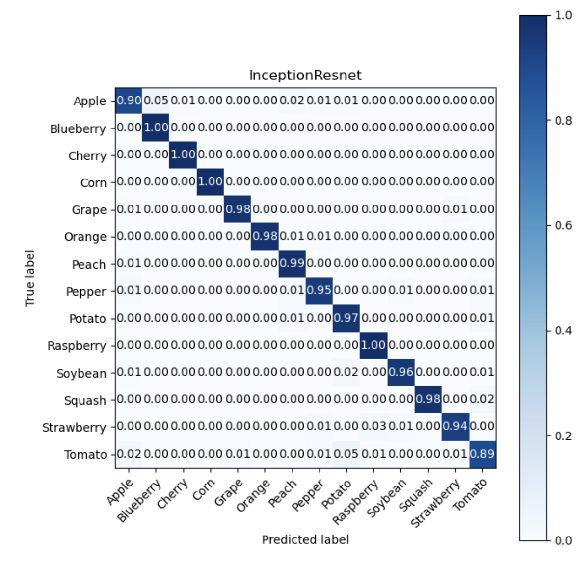

# Leaf Image Classification 
Goal: Build the model to predict 15 leaf classes with a state-of-the-art model and architecture.

## Dataset structure
The provided dataset for this project contains 17728 images already divided into sub-folders, based on their class. There are 14 different classes available.
 
From this dataset representation, we can see that each class does not close to a uniform distribution number, we can say that we have an imbalanced dataset. So we need to deal with this problem.

## Imbalanced dataset

In order to learn our model we should handle imbalanced data. We tried to implement two different approaches to manage the imbalanced class for our training data. We have tried two scenarios, balanced class weight then combined with data augmentation, and balanced data for each class. We also use Precision-Recall Curve (PRC) metrics to monitor our learning process. Precision-Recall curves summarize the trade-off between the true positive rate and the positive predictive value for a predictive model using different probability thresholds.

We have chosen PRC metrics for monitoring the learning process because we should take into account the imbalanced data train. The Accuracy metrics will lead us to misleading results. We will mostly always have high accuracy because the accuracy formula is the ratio of the total number of correct predictions over the total number of predictions. The fact that the Tomato class has a high number of training images. It influences accuracy results in a nondesirable way because the Tomato class can be considered as the dominant class and species with fewer class instances are minority classes. With Accuracy, there is no distinction between the numbers of correctly classified images of different classes. Therefore we should use another metric that can handle an imbalanced dataset. We combined the Precision and Recall metrics that are more promising to inspect the training process. We used PRC metrics to compare precision and recall combination results in each epoch. 

### Balanced class weight and Data Augmentation
We also tried train by considering class weight, in the model fit we are using class_weights parameters to have a balance weight based on the number of each class. So for this case, the Tomato class will have the lowest weight, and the Raspberry class will have the highest weight. 

With regard to Data augmentation, we have implemented data augmentation to manage imbalanced data. By implementing rotation, height shift, weight shift, zoom, flip and we realized that the fill mode nearest got a better result than reflected. So we are combining  balanced class weight and data augmentation. 

### Balanced data for each class
In this scenario we try to generate data manually for each class by using a Data Image Generator and save the generated data with the original data, then we will get a balanced training dataset for each class. Here is the Google Drive link to download the augmented dataset (https://drive.google.com/file/d/1PJK-r-ePQuXp2uh-G57Ni2EFyXiUZvx4/view?usp=sharing) 

## Model Selection

### Simple CNN Model
We have implemented a simple CNN model with five Convolution Layers and Max Pooling to get latent representation and then we are using flattening to feed into the Feedforward Neural Network as a classifier. 

### Simple CNN Model + Global Average Pooling
Instead of flattening, we are using Global Average Pooling. And it has improved our results. Because in practice we can see that flattening is prone to shifting image, and also more learnable parameters compare to GAP.

### Transfer Learning without Fine Tuning
Firstly we implemented VGG16 architecture with pre-trained weights for ImageNet and without top layers included, then we built the top layers using Global Average Pooling and three hidden layers for the classifier. And we can increase the result.

### Transfer Learning With Fine Tuning.
#### VGG19
We try architecture with pre-trained weights for ImageNet and without top layers included. Instead of freezing all layers, we try to unfreeze 15 layers from top layers. Then we built the top layers using Global Average Pooling and three hidden layers for the classifier. For the training and validation data, we are using a balanced class weight and data augmentation scenario.

#### EfficientNet B0
Similar to previous architecture we try to unfreeze 20 layers from top layers. But we kept the layer that has BatchNormalization. Because in the literature, when we unfreeze a model that contains BatchNormalization layers in order to do fine-tuning, we should keep the BatchNormalization layers in inference mode by passing training=False when calling the base model. Otherwise the updates applied to the non-trainable weights will suddenly destroy what the model has learned. For the train and validation data, we are using a balanced class weight and data augmentation scenario.

#### Xception
Same Unfreezing method, 20 layers from top layers and we kept the layer that has BatchNormalization. Then we built the top layers using Global Average Pooling and three hidden layers for the classifier.  For the data train and validation we are using a balanced class weight and data augmentation scenario.

#### ResNett50 and ResNet V2
We have unfreezed 20 layers from top layers and we keep the layer that has Batch Normalization. Then we built the top layers using Global Average Pooling and three hidden layers for the classifier.  For the data train and validation, we are using a balanced class weight and data augmentation scenario.

#### Inception-ResNet 
Instead of using a balanced class weight and data augmentation scenario. We tried to use balanced data for each class scenario. Then we implement Inception-ResNet architecture with unfreezed 14 layers from top layers and we keep the layer that has Batch Normalization. Then we built the top layers using Global Average Pooling and three hidden layers for the classifier.

## Result in CodaLab
| Model                  | Result       |
| ---------------------- | ------------ |
| Simple CNN Model       | 0.4433962264 |
| Simple CNN Model + GAP | 0.5679245283 |
| VGG16 No Fine Tuning   | 0.6396226415 |
| VGG19                  | 0.720754717  |
| EfficientNet B0        | 0.7339622642 |
| Xception               | 0.8094339623 |
| ResNet50               | 0.8509433962 |
| ResNet V2              | 0.8301886792 |
| Inception-ResNet       | 0.8867924528 |

## Result in with our testing data
 

